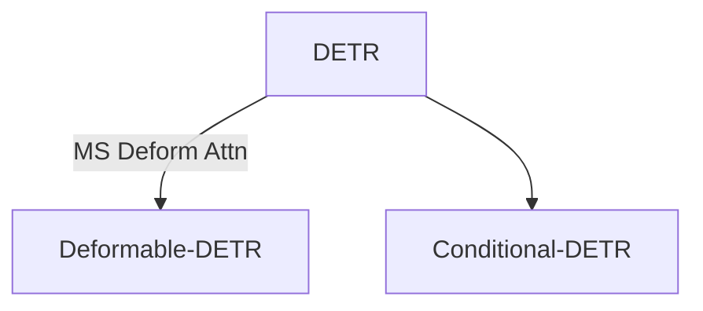

---
date:
  created: 2024-12-26
categories:
  - 文献整理
---

# DETR 框架相关研究

DETR 框架基本架构与原理，后续改进，以及各种下游任务模型，包括检测、分割等等 ...

<!-- more -->

> Reference:
> 1. detrex: https://github.com/IDEA-Research/detrex

- DETR: **End-to-End Object Detection with Transformers**. Nicolas Carion et al. 2020. [arxiv](https://arxiv.org/abs/2005.12872) [pdf](pdfs/DETR_Nicolas_Carion_et_al_2005.12872.pdf)

- Deformable-DETR: **Deformable DETR: Deformable Transformers for End-to-End Object Detection**. Xizhou Zhu et al. 2020. [arxiv](https://arxiv.org/abs/2010.04159) [pdf](pdfs/Deformable-DETR_Xizhou_Zhu_et_al_2010.04159.pdf)
- Conditional-DETR: **Conditional DETR for Fast Training Convergence**. Depu Meng et al. 2021. [arxiv](https://arxiv.org/abs/2108.06152) [pdf](pdfs/Conditional-DETR_Depu_Meng_et_al_2108.06152.pdf)
- Anchor-DETR: **Anchor DETR: Query Design for Transformer-Based Object Detection**. Yingming Wang et al. 2021. [arxiv](https://arxiv.org/abs/2109.07107) [pdf](pdfs/Anchor-DETR_Yingming_Wang_et_al_2109.07107.pdf)
- DAB-DETR: **DAB-DETR: Dynamic Anchor Boxes are Better Queries for DETR**. Shilong Liu et al. 2022. [arxiv](https://arxiv.org/abs/2201.12329) [pdf](pdfs/DAB-DETR_Shilong_Liu_et_al_2201.12329.pdf)
- DN-DETR: **DN-DETR: Accelerate DETR Training by Introducing Query DeNoising**. Feng Li et al. 2022. [arxiv](https://arxiv.org/abs/2203.01305) [pdf](pdfs/DN-DETR_Feng_Li_et_al_2203.01305.pdf)
- DINO: **DINO: DETR with Improved DeNoising Anchor Boxes for End-to-End Object  Detection**. Hao Zhang et al. 2022. [arxiv](https://arxiv.org/abs/2203.03605) [pdf](pdfs/DINO_Hao_Zhang_et_al_2203.03605.pdf)
- Co-DETR: **DETRs with Collaborative Hybrid Assignments Training**. Zhuofan Zong et al. 2022. [arxiv](https://arxiv.org/abs/2211.12860) [pdf](pdfs/Co-DETR_Zhuofan_Zong_et_al_2211.12860.pdf)

## SAM series

- SAM: **Segment Anything**. Alexander Kirillov et al. 2023. [arxiv](https://arxiv.org/abs/2304.02643) [pdf](pdfs/SAM_Alexander_Kirillov_et_al_2304.02643.pdf)
- SAM2: **SAM 2: Segment Anything in Images and Videos**. Nikhila Ravi et al. 2024. [arxiv](https://arxiv.org/abs/2408.00714) [pdf](pdfs/SAM2_Nikhila_Ravi_et_al_2408.00714.pdf)